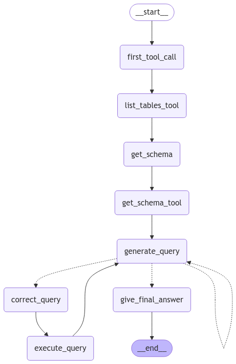

# sql-agent-langgraph-streamlit
LLM Agent for interacting with a SQL database using LangGraph and Streamlit

# Chat with SQL Data Using LangGraph, LangChain, and Streamlit

This project demonstrates a simple yet powerful way to interact with SQL databases through a conversational interface. Built with LangGraph, LangChain, and Streamlit, the system allows users to chat with any SQL database, providing intuitive query generation and database exploration capabilities.

## Features

- **SQL Interaction via Chat**: Seamlessly query and explore your SQL database using natural language input.
- **LangChain Integration**: Leverages LangChain's `from langchain_community.utilities import SQLDatabase` utility to connect and interact with databases effectively.
- **Streamlit Interface**: A clean and user-friendly interface built with Streamlit for real-time interaction.

This is a demo application based on a tutorial provided by LangGraph https://langchain-ai.github.io/langgraph/tutorials/sql-agent/, designed to showcase the potential of using natural language processing (NLP) for database querying. 

## Graph

## Future Improvements

While this is a working prototype, there are several areas for improvement, including:

- **Retrieval-Augmented Generation (RAG)**: Integration of RAG to enhance the querying capabilities by retrieving relevant data before generating responses.
- **Enhanced SQL Search and Query Prompts**: Refining the SQL query generation logic for better accuracy and efficiency in responding to user queries.

I will continue working on these improvements and plan to release them in future.

## How to use:
-   Clone this repository `git clone <repository-url>`
-   Initialize poetry with `poetry init -n`
-   Run `poetry config virtualenvs.in-project true` so that virtualenv will be present in project directory
-   Run `poetry env use <C:\Users\username\AppData\Local\Programs\Python\Python311\python.exe>` to create virtualenv in project (change username to your username)
-   Run `poetry shell`
-   Run `poetry install` to install requried packages
-   Create `.env` file and insert all keys: `GROQ_API_KEY`
-   Run `streamlit run app.py`
